# Architecture

## Branching Hierarchy

The repository follows a strict hierarchical branching model where each level serves a specific purpose:

```mermaid
graph TB
    Main["🏠 Main Branch<br/>(Production)"]
    Task["📋 Task Branch<br/>task/X-name<br/>Label: implementation"]
    Feature["✨ Feature Branch<br/>feature/X-name<br/>Label: addition"]
    Bug["🐛 Bug Branch<br/>bug/X-name<br/>Label: fix"]
    Hotfix["🚑 Hotfix Branch<br/>hotfix/X-name<br/>Label: fix"]

    Task -->|"Merge<br/>Bump 2nd digit"| Main
    Feature -->|"Merge<br/>Bump 3rd digit"| Task
    Bug -->|"Merge<br/>Bump 4th digit"| Feature
    Hotfix -->|"Merge<br/>Bump letter"| Bug
    Hotfix -.->|"Emergency<br/>Bump letter"| Main

    style Main fill:#28a745,color:#fff
    style Task fill:#0052CC,color:#fff
    style Feature fill:#1D76DB,color:#fff
    style Bug fill:#D73A4A,color:#fff
    style Hotfix fill:#B60205,color:#fff
```



### Text Representation

```
Main (Production)
  ↑
Task (Major work units)
  ↑
Feature (Sub-components)
  ↑
Bug (Fixes)
  ↑
Hotfix (Urgent fixes)
```

### Branch Types

#### Main Branch

-   **Purpose**: Stable production code
-   **Merges from**: Task branches only
-   **Protection**: Highest level of protection, requires PR reviews

#### Task Branches

-   **Purpose**: Major units of work or epics
-   **Naming**: `task/<issue-id>-<slug>`
-   **Merges to**: Main
-   **Merges from**: Feature branches
-   **Creates**: Automatically when an issue with `task` label is opened
-   **PR Label**: `implementation`

#### Feature Branches

-   **Purpose**: Sub-components or individual features within a task
-   **Naming**: `feature/<issue-id>-<slug>`
-   **Merges to**: Parent task branch
-   **Merges from**: Bug branches
-   **Parent**: Requires Parent Task Issue Number
-   **Creates**: Automatically when an issue with `feature` label is opened
-   **PR Label**: `addition`

#### Bug Branches

-   **Purpose**: Fixes for features or tasks
-   **Naming**: `bug/<issue-id>-<slug>`
-   **Merges to**: Parent feature or task branch
-   **Merges from**: Hotfix branches
-   **Parent**: Requires Parent Issue Number
-   **Creates**: Automatically when an issue with `bug` label is opened
-   **PR Label**: `fix`

#### Hotfix Branches

-   **Purpose**: Urgent fixes requiring immediate attention
-   **Naming**: `hotfix/<issue-id>-<slug>`
-   **Merges to**: Parent bug branch (or main in emergencies)
-   **Parent**: Requires Parent Issue Number
-   **Creates**: Automatically when an issue with `hotfix` label is opened
-   **PR Label**: `fix`

## Branch Naming Convention

### Automated Naming (Issue-Driven)

When using the issue-driven workflow, branches are automatically named:

```
<type>/<issue-number>-<slugified-title>
```

**Example**: Issue #42 with title "[Feature]: Add user authentication"

-   Branch name: `feature/42-add-user-authentication`

The slug is automatically generated by:

1. Removing the type prefix (e.g., `[FEATURE]:`)
2. Converting to lowercase
3. Replacing non-alphanumeric characters with hyphens
4. Removing consecutive hyphens
5. Trimming leading/trailing hyphens

### Manual Naming (Rapid Development)

For manual branch creation, follow this pattern:

```
<type>/<descriptive-slug>
```

**Examples**:

-   `task/user-authentication`
-   `feature/login-form`
-   `bug/fix-validation-error`
-   `hotfix/patch-security-issue`

**Note**: After creating a manual branch, you must:

1. Create a corresponding GitHub issue
2. Create a PR with the appropriate label
3. Reference the issue in the PR description

## Workflow Automation

### Issue-Driven Development

All work starts with a GitHub Issue:

1. **Developer** opens issue with appropriate label (`task`, `feature`, `bug`, or `hotfix`)
2. **GitHub Actions** workflow triggers automatically
3. **Workflow** creates the branch with correct naming
4. **Workflow** creates a pull request to the appropriate parent branch
5. **Workflow** applies the appropriate label to the PR
6. **Workflow** comments on the issue with branch and PR links

### Pull Request Labels

When PRs are automatically created, they receive labels that categorize the type of change:

-   **`implementation`** - Applied to task PRs (major implementations)
-   **`addition`** - Applied to feature PRs (new additions to existing work)
-   **`fix`** - Applied to bug and hotfix PRs (corrections and fixes)

### Parent-Child Relationships

The hierarchy is enforced through issue templates:

-   **Task**: No parent required (branches from main)
-   **Feature**: Must specify Parent Task Issue Number
-   **Bug**: Must specify Parent Issue Number (usually a feature)
-   **Hotfix**: Must specify Parent Issue Number (usually a bug, but can be main)

If a parent issue number is invalid or not found, the workflow falls back to the `main` branch.

## Emergency Procedures

### Direct Hotfix to Main

In production emergencies, hotfixes can target `main` directly:

1. Create hotfix issue
2. Specify `main` as the Parent Issue Number
3. Workflow creates branch from main
4. PR targets main directly
5. Version bumps with letter suffix (e.g., `0.1.2.1a`)

### Manual Workflow Triggers

If automation fails, use workflow dispatch:

1. Go to **Actions** tab
2. Select the appropriate workflow
3. Click **Run workflow**
4. Enter the issue number
5. Workflow executes manually

## Critical Files

### VERSION

-   **Purpose**: Single source of truth for version number
-   **Format**: `Major.Task.Feature.Bug[a-z]`
-   **Updates**: Automatically via workflows on merge

### package.json

-   **Purpose**: Project metadata and dependencies
-   **Version**: Synced with VERSION file automatically
-   **Updates**: When VERSION changes

### .github/workflows/

-   **Purpose**: Contains all automation logic
-   **Files**:
    -   `create-task-branch.yml` - Task branch automation
    -   `create-feature-branch.yml` - Feature branch automation
    -   `create-bug-branch.yml` - Bug branch automation
    -   `create-hotfix-branch.yml` - Hotfix branch automation
    -   `version-bump.yml` - Version bumping on merges
    -   `direct-push-version-bump.yml` - Version bumping on direct pushes

### .github/ISSUE_TEMPLATE/

-   **Purpose**: Standardized issue forms
-   **Files**:
    -   `task.yml` - Task issue template
    -   `feature.yml` - Feature issue template
    -   `bug.yml` - Bug issue template
    -   `hotfix.yml` - Hotfix issue template

## Benefits of This Architecture

### Traceability

Every change is tied to an issue, providing complete audit trail from requirement to implementation.

### Isolation

Work is isolated in branches, preventing conflicts and enabling parallel development.

### Automation

Manual branch creation and naming errors are eliminated through automation.

### Versioning

Version numbers reflect the hierarchy, making it clear what level of change was made.

### Flexibility

The hierarchy supports any scale of development, from hotfixes to major features.

### Collaboration

Clear structure makes it easy for teams to coordinate and understand project state.
