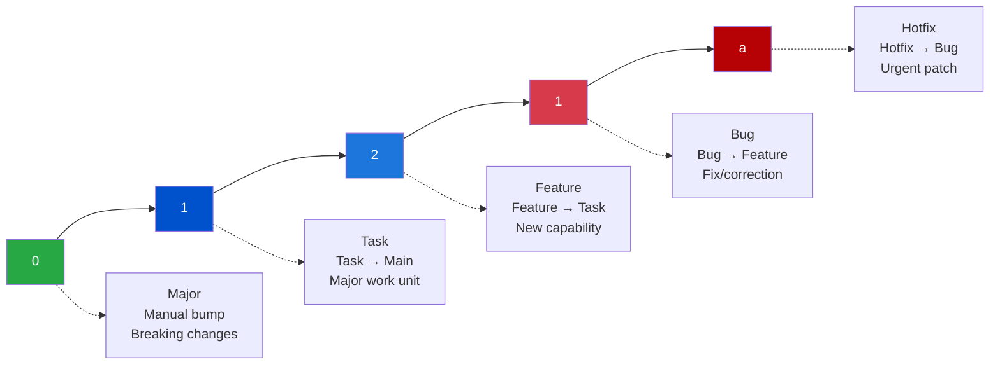

# Versioning

## Version Format

This project uses a **4-digit semantic versioning** scheme with an optional alphabetical hotfix postfix:

```
Major.Task.Feature.Bug[a-z]
```

### Visual Representation



### Examples

-   `0.1.2.1` - Standard version
-   `1.0.0.0` - First major release
-   `0.2.5.3` - Task 2, Feature 5, Bug 3
-   `0.1.3.1a` - Bug 1 with first hotfix
-   `0.1.3.1b` - Bug 1 with second hotfix

## Version Digit Meanings

### First Digit: Major Version

-   **Bumps**: Manual only (typically via releases)
-   **Meaning**: Major architectural changes, breaking changes, major milestones
-   **Resets**: All other digits to 0

### Second Digit: Task Number

-   **Bumps**: When a task branch merges to main
-   **Meaning**: Completion of a major unit of work
-   **Resets**: Feature, Bug, and Hotfix digits to 0

### Third Digit: Feature Number

-   **Bumps**: When a feature branch merges to a task
-   **Meaning**: Addition of a new component or capability
-   **Resets**: Bug and Hotfix digits to 0

### Fourth Digit: Bug Number

-   **Bumps**: When a bug branch merges to a feature
-   **Meaning**: A fix or correction has been applied
-   **Resets**: Hotfix letter to none

### Letter Suffix: Hotfix Letter

-   **Bumps**: When a hotfix branch merges to a bug (or directly to main)
-   **Meaning**: An urgent patch has been applied
-   **Increments**: Alphabetically (a → b → c → etc.)
-   **Resets**: When any standard digit is bumped

## Automatic Version Bumping

### Via Pull Request Merges

Version bumps happen automatically when PRs are merged:

| Merge Path     | Version Change         | Example                             |
| -------------- | ---------------------- | ----------------------------------- |
| Task → Main    | Bumps 2nd digit        | `0.1.x.x` → `0.2.0.0`               |
| Feature → Task | Bumps 3rd digit        | `0.1.2.x` → `0.1.3.0`               |
| Bug → Feature  | Bumps 4th digit        | `0.1.2.1` → `0.1.2.2`               |
| Hotfix → Bug   | Adds/increments letter | `0.1.2.1` → `0.1.2.1a` → `0.1.2.1b` |

**Note**: Merging a Bug directly to a Task does not trigger automatic version bumping to avoid confusion in the hierarchy.

### Via Direct Push to Main

For cases where you bypass the issue workflow (use sparingly), commit message prefixes trigger version bumps:

| Prefix    | Version Change         | Example Commit                    |
| --------- | ---------------------- | --------------------------------- |
| `task:`   | Bumps 2nd digit        | `task: implement user management` |
| `feat:`   | Bumps 3rd digit        | `feat: add password reset`        |
| `bug:`    | Bumps 4th digit        | `bug: fix validation error`       |
| `hotfix:` | Adds/increments letter | `hotfix: patch security issue`    |

**Example**:

```bash
git commit -m "feat: add new API endpoint"
# This will bump the 3rd digit when pushed to main
```

## Version Bump Workflow

The version bumping process:

1. **PR Merge Detected**: Workflow triggers on PR close to main or hierarchy branches
2. **Branch Type Identified**: Determines which digit to bump based on branch name
3. **VERSION File Updated**: Reads current version, calculates new version, writes back
4. **package.json Synced**: Updates version field to match VERSION file
5. **Changes Committed**: Commits version changes with standard message
6. **Changes Pushed**: Pushes commit back to the target branch

## Version File Format

### VERSION File

Located at the root: `/VERSION`

```
0.1.2.1
```

-   Plain text file
-   Single line
-   No additional formatting
-   Source of truth for version

### package.json

The `version` field is automatically synchronized:

```json
{
  "name": "your-project",
  "version": "0.1.2.1",
  ...
}
```

## Manual Version Updates

### When to Update Manually

-   Major version bumps (first digit)
-   Resetting version to a specific number
-   Correcting an incorrect version

### How to Update Manually

```bash
# Edit VERSION file
echo "1.0.0.0" > VERSION

# Edit package.json
# Update the "version" field to match

# Commit both
git add VERSION package.json
git commit -m "chore: bump to version 1.0.0.0"
git push origin main
```

**Important**: Always keep VERSION and package.json in sync!

## Version History

### Checking Version History

```bash
# See all version changes
git log --all --grep="bump version"

# See current version
cat VERSION

# See version at specific commit
git show <commit-hash>:VERSION
```

### Tracking Releases

Use GitHub Releases to mark significant versions:

1. Create a tag: `git tag v1.0.0.0`
2. Push tag: `git push origin v1.0.0.0`
3. Create release on GitHub with tag
4. Add release notes describing changes

## Common Scenarios

### Scenario 1: New Feature Development

```
Initial: 0.1.0.0

1. Open task issue (#10)
   - Branch: task/10-user-dashboard
   - No version change yet

2. Open feature issue (#11) for login component
   - Parent: Task #10
   - Branch: feature/11-login-component
   - No version change yet

3. Merge feature → task
   - Version: 0.1.0.0 → 0.1.1.0

4. Merge task → main
   - Version: 0.1.1.0 → 0.2.0.0
```

### Scenario 2: Bug Fix

```
Current: 0.2.0.0

1. Open bug issue (#15) on feature branch
   - Parent: Feature #11
   - Branch: bug/15-fix-login-validation

2. Merge bug → feature
   - Version: 0.2.0.0 → 0.2.0.1
```

### Scenario 3: Emergency Hotfix

```
Production: 0.2.0.1

1. Critical bug discovered in production
2. Open hotfix issue (#20)
   - Parent: Bug #15
   - Branch: hotfix/20-patch-security

3. Merge hotfix → bug
   - Version: 0.2.0.1 → 0.2.0.1a

4. Need another fix
5. Open hotfix issue (#21)
   - Branch: hotfix/21-additional-patch

6. Merge second hotfix → bug
   - Version: 0.2.0.1a → 0.2.0.1b
```

## Best Practices

### DO:

-   ✅ Let automation handle version bumps
-   ✅ Keep VERSION and package.json in sync
-   ✅ Use semantic commit prefixes for direct pushes
-   ✅ Document major version changes in releases
-   ✅ Tag releases with version numbers

### DON'T:

-   ❌ Manually edit version in feature/bug branches
-   ❌ Skip version bumps by merging without PR
-   ❌ Make version changes in multiple places
-   ❌ Use version numbers inconsistently
-   ❌ Forget to sync VERSION with package.json

## Troubleshooting

### Version Didn't Bump

**Check**:

1. Workflow executed? (Actions tab)
2. Correct branch name format?
3. Merged via PR or direct push?
4. Permissions set correctly?

**Fix**:

1. Verify branch naming
2. Check workflow logs
3. Manually bump if needed
4. Re-run failed workflow

### Version Bumped Wrong Digit

**Cause**: Usually incorrect branch naming or merge target

**Fix**:

```bash
# Revert the version bump commit
git revert <version-bump-commit>

# Manually set correct version
echo "0.1.3.0" > VERSION
# Update package.json to match

git add VERSION package.json
git commit -m "fix: correct version to 0.1.3.0"
git push origin main
```

### Hotfix Letter Skipped

**Cause**: Likely a standard version bump happened, resetting the letter

**Expected Behavior**: Any task/feature/bug merge resets the hotfix letter

**Fix**: Not needed - this is intentional behavior

## Version Queries

### Check Current Version

```bash
cat VERSION
```

### Check package.json Version

```bash
node -p "require('./package.json').version"
```

### Verify Sync

```bash
# Should output matching versions
cat VERSION && node -p "require('./package.json').version"
```

### Find Version at Tag

```bash
git show v1.0.0.0:VERSION
```
